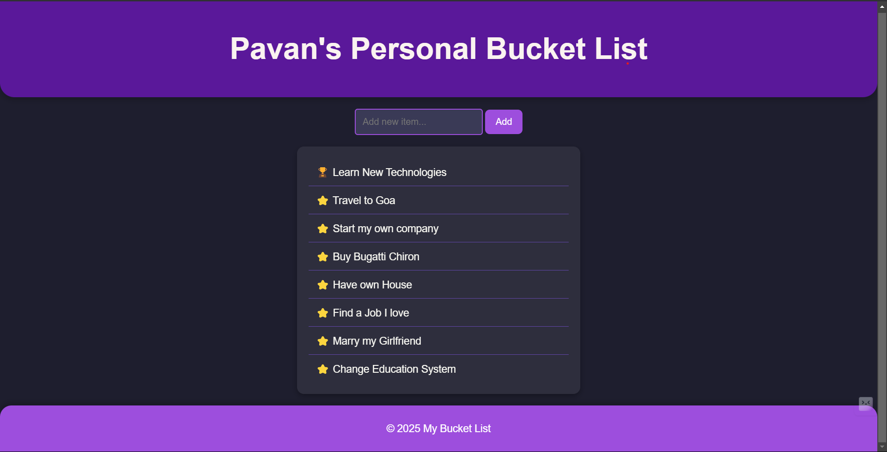
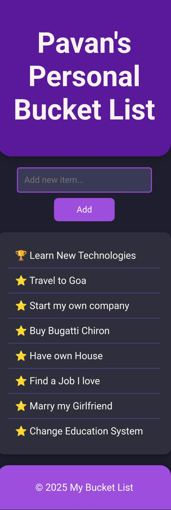

# 📝 Personal Bucket List Web App

This project is **Internship Task 1 from MotionCut**, where we build a **Personal Bucket List Web App** using **HTML, CSS, and JavaScript**.  
It allows users to **add, mark, and manage** their bucket list items **dynamically** while preserving data using **local storage**.

---

## ✨ Features

✅ **Add New Tasks** – Users can add new goals to their personal bucket list.  
✅ **Mark Tasks as Completed** – Clicking a task will strike it out, showing it's done.  
✅ **Persistent Storage** – Data remains saved even after reloading the page.  
✅ **Hover Animations** – Smooth **color transitions & scaling** effects.  
✅ **Drag & Drop Support** – Easily reorder tasks for better organization.  
✅ **Fully Responsive Design** – Works smoothly on both desktop & mobile.  

---

## 🚀 Live Demo
Check out the live version of this project:  
🔗 **[Live Demo](https://Pavansai20054.github.io/bucket-list-app/)**

---

## 📂 Project Structure

```bash
/bucket-list-app
│── index.html # Main HTML file
│── styles.css # Styling for the web app
│── scripts.js # JavaScript functionality
│── README.md # Project documentation
│── LICENSE # MIT License file
```

## ⚙️ Technologies Used
- **HTML5** – Structure of the webpage
- **CSS3** – Styling & animations
- **JavaScript (ES6)** – Dynamic functionality, local storage, drag & drop
- **Local Storage** – Saves user data persistently

---

## 🛠️ How to Set Up Locally

1. **Clone the repository**  
   ```bash
   git clone https://github.com/yourusername/bucket-list-app.git

2. **Navigate to the project folder**
   ```bash
   cd bucket-list-app
   ```

3. **Open `index.html` in your browser**

## 📸Screenshots
### 🖥️Desktop View


### 📱Mobile View
<center></center>

## 📝 License
This project is licensed under the **MIT License**. See the **LICENSE** file for details.

## Contact
For questions or feedback, you can reach me at:

Email: psai49779@gmail.com

GitHub: https://github.com/Pavansai20054